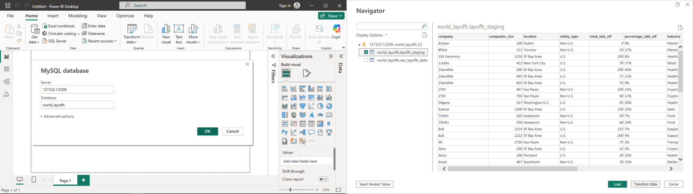
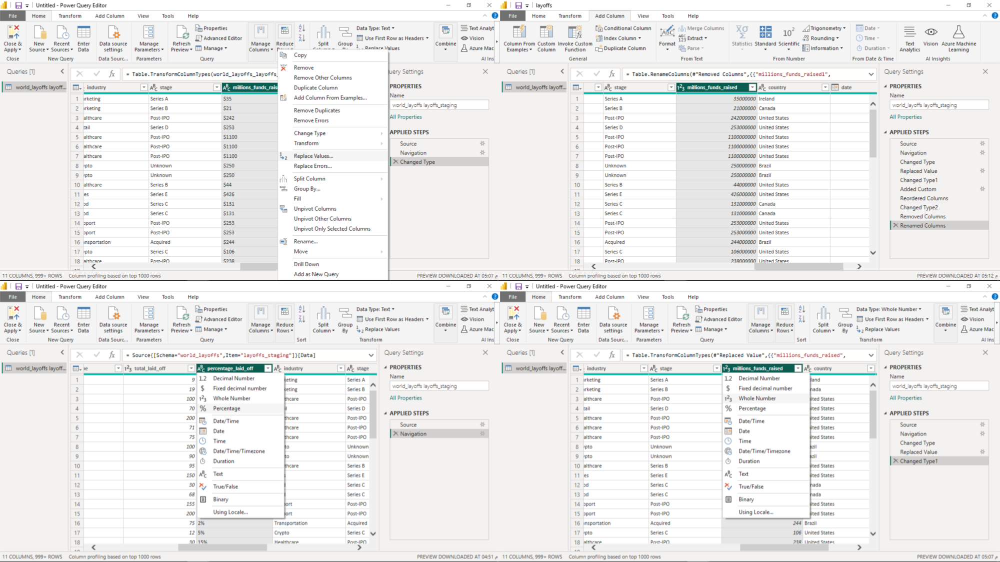
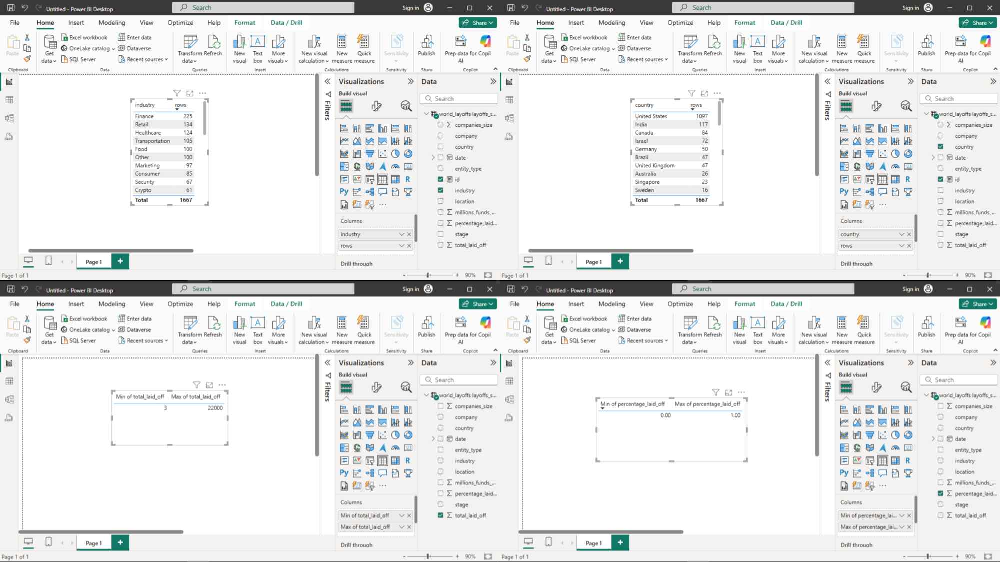
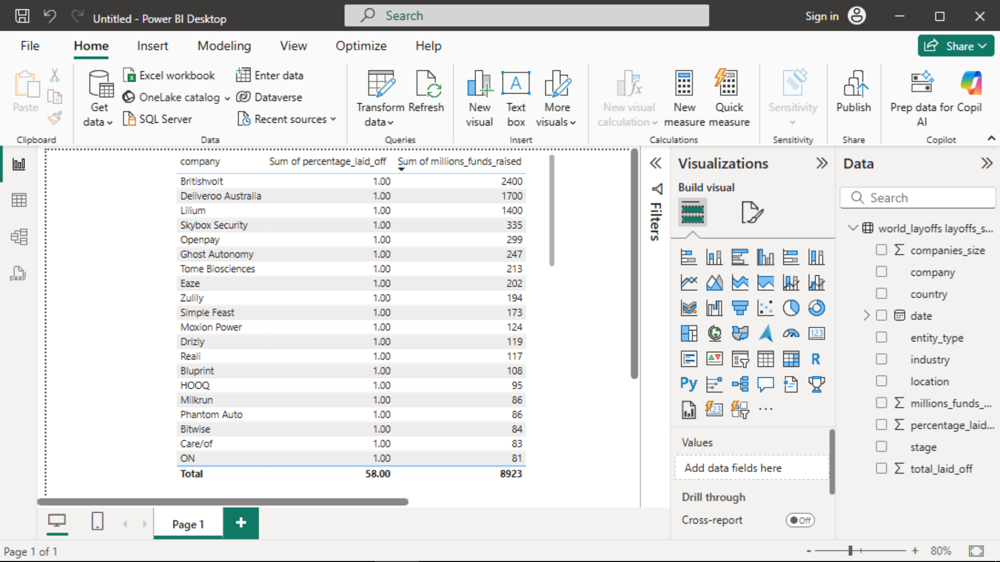
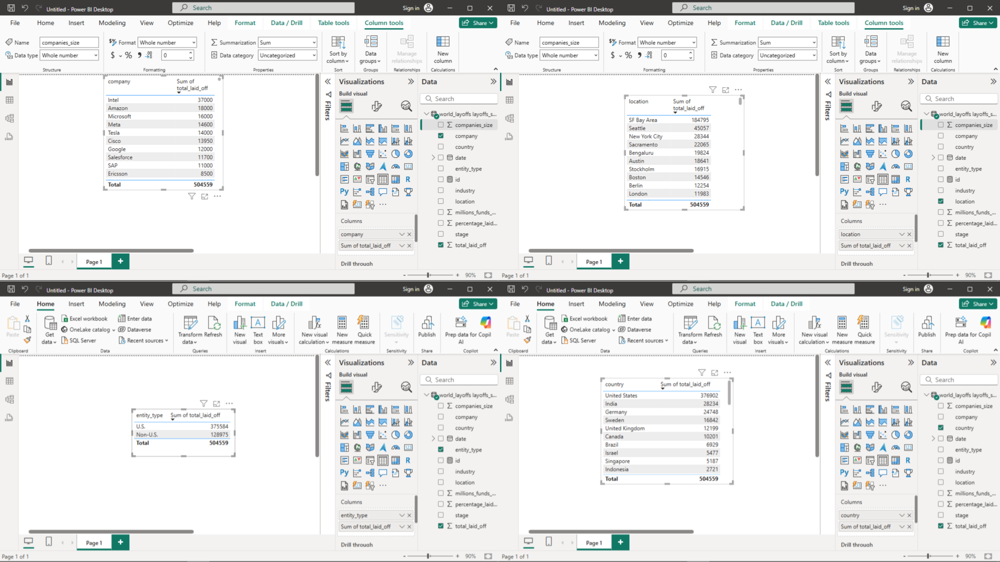
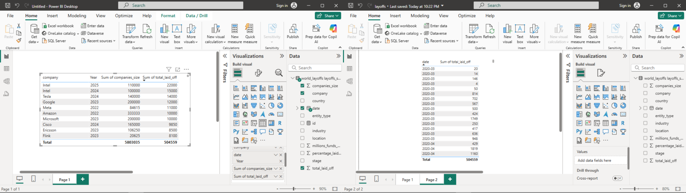
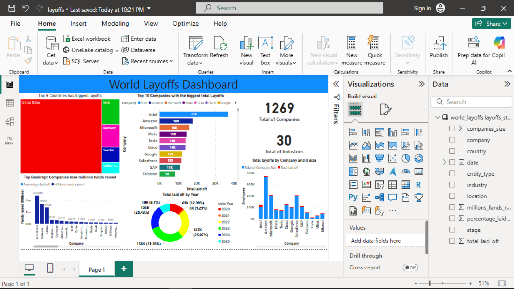

# Layoffs Data Project: Analysis(EDA) and Visualization in Power BI

[](https://media.istockphoto.com/id/1488294044/photo/businessman-works-on-laptop-showing-business-analytics-dashboard-with-charts-metrics-and-kpi.jpg?s=612x612&w=0&k=20&c=AcxzQAe1LY4lGp0C6EQ6reI7ZkFC2ftS09yw_3BVkpk=)

## Description

#### Layoffs Data Source: [Layoffs Data](https://www.kaggle.com/datasets/swaptr/layoffs-2022)
#### The layoffs data availability is from when COVID-19 was declared as a pandemic i.e. 11 March 2020 to present.


### List of most important Columns

```
1) company : Companies Name
2) total_laid_off :  Number of laid-off employees in each company
3) percentage_laid_off : Percentage of laid-off employees in each company
4) industry :  Companies Industry
5) funds_raised : Funds raised by the company (in Millions $)
6) date :  Date of laid-off employees in each company
```

### - - - PROCESSESS  - - -

### Power BI Processess

* Load clean data from MySQL Database

* Power Query (There are not many things that need to be modified because our data is already clean in MySQL)

* Layoffs Data Analysis (EDA)
  * 1- Descriptive Analysis & Univariate Destributions
  
  * 2- Top Bankrupt Companies and How much did these companies lose millions funds raised ?
  
  * 3- Bivariate & Relational Analysis
  

  
* Layoffs data Dashboard


### Requirements
* MySQL 8+
* Power BI
